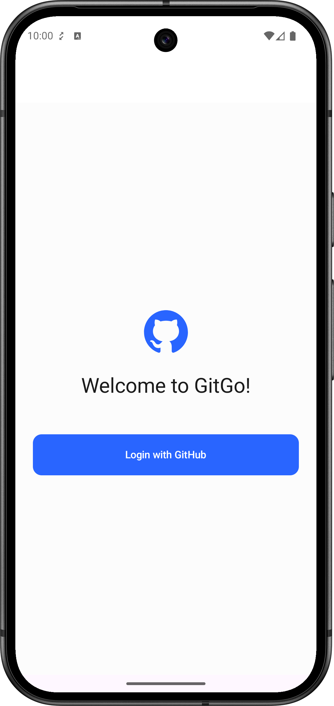
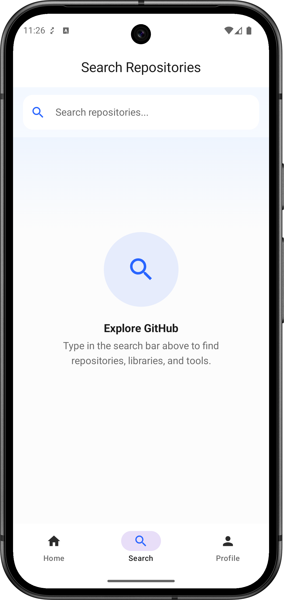
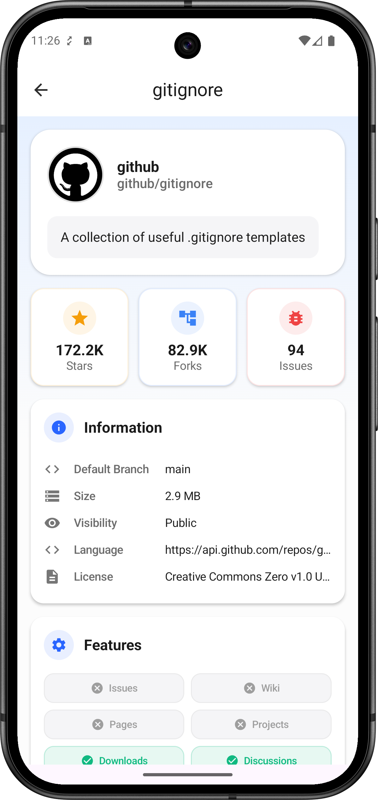

# GitGo 🚀


**GitGo** is a modern, native Android application that allows users to authenticate with GitHub, search repositories, view detailed statistics, and manage their profile.

Built to demonstrate **modern Android development practices**, it focuses on a scalable architecture, secure authentication flows, and a polished UI.

## 📱 Screenshots & Demo

| Login & Auth | Home & Quick Actions | Search & Pagination | Repository Details |
|:---:|:---:|:---:|:---:|
|  |  |  |  |

*(Note: Replace `art/login.png`, etc., with your actual file names)*

## 🛠 Tech Stack

* **Language:** Kotlin (100%)
* **UI Toolkit:** [Jetpack Compose](https://developer.android.com/jetpack/compose) (Material 3)
* **Architecture:** MVVM + Clean Architecture principles
* **Dependency Injection:** [Hilt](https://dagger.dev/hilt/)
* **Networking:** [Retrofit](https://square.github.io/retrofit/) + [OkHttp](https://square.github.io/okhttp/)
* **Async:** Coroutines + Flow
* **Image Loading:** [Glide](https://github.com/bumptech/glide) (with Compose integration)
* **Pagination:** [Paging 3](https://developer.android.com/topic/libraries/architecture/paging/v3) (Infinite scrolling for search/issues)
* **Navigation:** Jetpack Navigation Compose

## 💡 Key Features

* **Secure OAuth 2.0 Authentication:** Implements the full "Authorization Code" flow. Client Secrets are secured via `local.properties` and injected via `BuildConfig` to prevent API key leakage.
* **Reactive Search:** Implements `Debounce` and `FlatMapLatest` operators to optimize network calls and handle rate limiting efficiently.
* **Infinite Scrolling:** Uses Paging 3 to handle large datasets (Issues, Search Results) with loading states and error handling.
* **Dynamic UI:** Custom `QuickAction` components and standardized "State-Aware" screens (Loading/Error/Content).

## 🏗 Architecture

The app follows a modularized, layered architecture:

```mermaid
graph TD
    UI[UI Layer (Compose)] --> VM[ViewModel]
    VM --> Repo[Repository]
    Repo --> Remote[Remote Data Source (Retrofit)]
    Repo --> Local[Local Data Source (Preferences)]